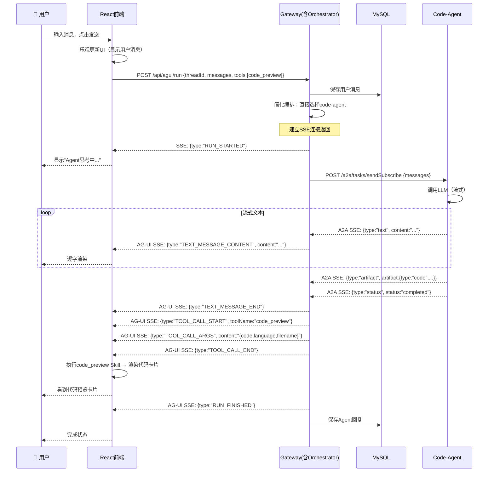
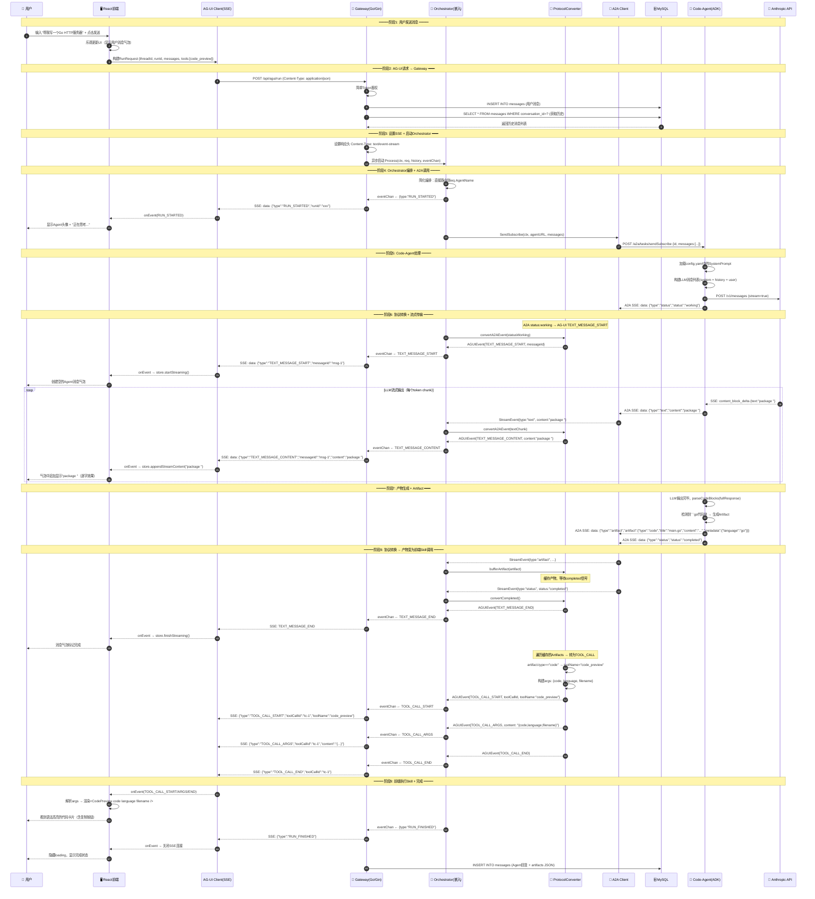
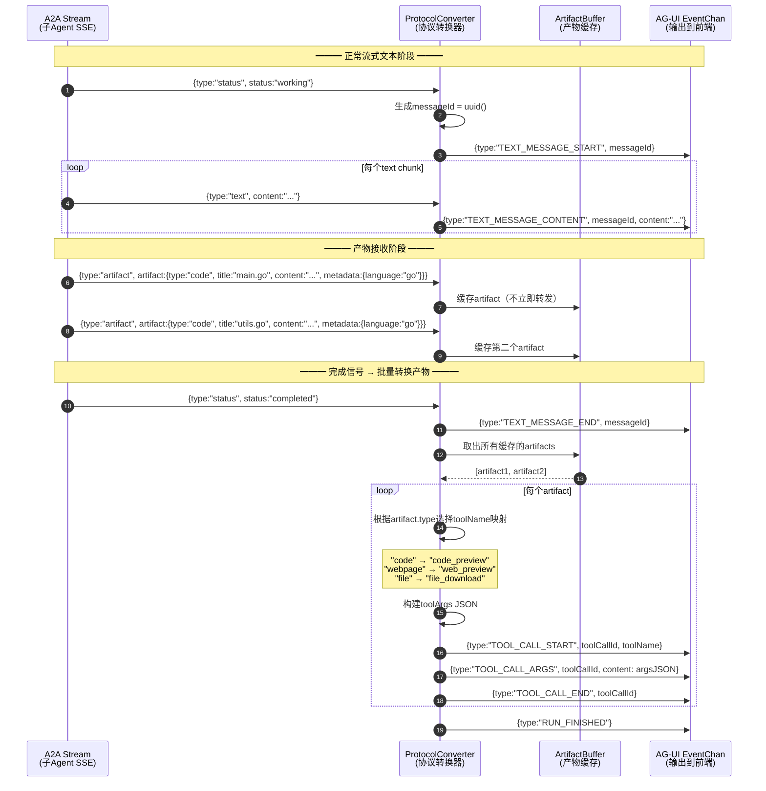
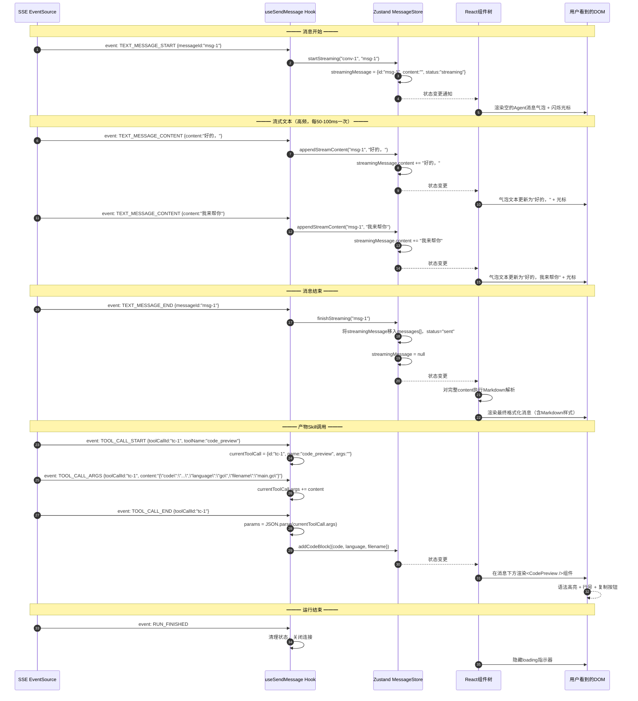
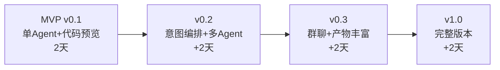

# AgentHub MVP（最小可行产品）实施方案

## 文档信息

| 项目 | 内容 |
|------|------|
| 项目名称 | AgentHub - 多Agent协作平台 MVP |
| 文档版本 | v1.1 |
| 创建日期 | 2026-05-22 |
| 关联文档 | PDR-AgentHub多Agent协作平台.md |
| 开发团队 | 2人（前端+后端/Agent） |
| MVP 周期 | 2天 |
| MVP 目标 | 端到端跑通：用户发消息 → 意图编排 → 子Agent处理 → 流式回复 + 产物预览 |

---

## 一、MVP 定义与目标

### 1.1 MVP 核心原则

> **MVP = 能跑通完整链路的最小功能集**，不追求完美，追求"能演示、能验证架构"。

- ✅ 全链路可跑通（前端 → Gateway → Orchestrator → 子Agent → 流式回复）
- ✅ 核心协议验证（AG-UI + A2A 协议转换正确）
- ✅ 至少1个子Agent可用（code-agent）
- ✅ 基础IM体验（发消息、收流式回复、代码预览）
- ❌ 不做群聊多Agent协作
- ❌ 不做自建Agent
- ❌ 不做部署发布
- ❌ 不做完善的错误处理和降级
- ❌ 不做UI打磨和动画

### 1.2 MVP 验收标准（Demo 场景）

MVP 完成后，需要能演示以下场景：

```
用户操作：
1. 打开 AgentHub 网页
2. 看到对话列表（左侧）
3. 点击"新建对话"，选择 code-agent
4. 在输入框输入："帮我写一个Go的HTTP服务器，支持CORS"
5. 点击发送

系统响应：
1. 消息气泡出现在右侧（用户消息）
2. Agent头像出现在左侧，显示"正在思考..."
3. 文字逐字流式出现（Agent回复）
4. 回复结束后，出现一个代码预览卡片（语法高亮、有复制按钮）
5. 用户可以继续追问："加上日志中间件"
6. Agent基于上下文继续回复
```

### 1.3 MVP 功能范围

| 功能 | MVP 范围 | 不做 |
|------|----------|------|
| **对话管理** | 新建对话、对话列表、切换对话 | 搜索、置顶、归档、删除 |
| **消息收发** | 发送文本、接收流式回复 | 文件上传、@提及、引用回复 |
| **Agent选择** | 新建对话时选择Agent | Agent市场、自建Agent |
| **流式渲染** | 逐字出现 + 完成后解析 | 中途停止、重新生成 |
| **产物预览** | 代码预览（语法高亮+复制） | 网页预览、Diff、部署 |
| **意图编排** | 单Agent直接路由 | 多Agent并行/串行编排 |
| **子Agent** | 1个 code-agent | web-agent、doc-agent |
| **数据持久化** | 消息存DB、重启不丢失 | 消息分页加载、历史搜索 |
| **鉴权** | 简单token（硬编码/环境变量） | JWT、用户注册登录 |

---

## 二、MVP 技术架构

### 2.1 精简架构图

```
┌──────────────────────────────────────────────────────┐
│           Frontend (React + AG-UI Client)             │
│  ┌────────────┐  ┌──────────────┐  ┌─────────────┐  │
│  │ 对话列表    │  │  聊天窗口     │  │ 代码预览     │  │
│  └────────────┘  └──────────────┘  └─────────────┘  │
└──────────────────────────────────────────────────────┘
                         │ AG-UI (SSE)
                         ▼
┌──────────────────────────────────────────────────────┐
│              Gateway (Go + Gin)                        │
│  ┌────────────┐  ┌──────────────┐  ┌─────────────┐  │
│  │ AG-UI端点   │  │  会话API      │  │ 简单鉴权     │  │
│  └────────────┘  └──────────────┘  └─────────────┘  │
└──────────────────────────────────────────────────────┘
                         │ 内部调用
                         ▼
┌──────────────────────────────────────────────────────┐
│         Orchestrator (Go，嵌入Gateway进程)             │
│  ┌────────────────────┐  ┌────────────────────────┐  │
│  │ 意图编排(简化版)     │  │ A2A↔AG-UI 协议转换     │  │
│  └────────────────────┘  └────────────────────────┘  │
└──────────────────────────────────────────────────────┘
                         │ A2A Protocol
                         ▼
┌──────────────────────────────────────────────────────┐
│           Code-Agent (Go + ADK Runtime)               │
│  ┌────────────┐  ┌──────────────┐  ┌─────────────┐  │
│  │ AgentCard   │  │  A2A Server   │  │ LLM调用     │  │
│  └────────────┘  └──────────────┘  └─────────────┘  │
└──────────────────────────────────────────────────────┘
                         │
                         ▼
              ┌─────────────────────┐
              │       MySQL 8       │
              └─────────────────────┘
```

### 2.2 MVP 简化决策

| 决策点 | MVP 方案 | 理由 |
|--------|----------|------|
| Orchestrator 部署 | **嵌入 Gateway 进程** | 减少服务数量，简化部署 |
| 意图编排 | **直接路由到指定Agent**（不调LLM） | MVP只有1个Agent，无需编排 |
| 数据库 | **MySQL 8**（Docker） | 持久化消息，团队更熟悉 |
| 缓存 | **暂不用Redis** | MVP不需要复杂缓存 |
| 前端Skills | **只实现 `code_preview`** | 最核心的产物展示 |
| 鉴权 | **固定Token** | 简化开发 |
| Agent注册 | **配置文件写死** | 不需要动态发现 |

### 2.3 MVP 数据流（简化版）



---

## 三、系统完整时序图

### 3.1 全链路时序图（端到端详细版）



### 3.2 协议转换详细时序图



### 3.3 前端流式渲染时序图



---

## 四、MVP 目录结构

```
agenthub/
├── frontend/                        # 前端 (React)
│   ├── src/
│   │   ├── App.tsx                  # 入口
│   │   ├── components/
│   │   │   ├── ChatLayout.tsx       # 整体布局（左列表+右聊天）
│   │   │   ├── ConversationList.tsx # 对话列表
│   │   │   ├── ChatWindow.tsx       # 聊天窗口
│   │   │   ├── MessageBubble.tsx    # 消息气泡
│   │   │   ├── MessageInput.tsx     # 输入框
│   │   │   ├── StreamingText.tsx    # 流式文本渲染
│   │   │   ├── CodePreview.tsx      # 代码预览卡片（MVP唯一Skill）
│   │   │   └── AgentAvatar.tsx      # Agent头像
│   │   ├── agui/
│   │   │   ├── client.ts           # AG-UI Client封装（SSE解析）
│   │   │   ├── events.ts           # 事件处理Hook
│   │   │   └── skills.ts           # Skills注册（MVP只有code_preview）
│   │   ├── stores/
│   │   │   ├── conversationStore.ts # 对话状态
│   │   │   └── messageStore.ts      # 消息状态
│   │   ├── services/
│   │   │   └── api.ts              # REST API调用
│   │   └── types/
│   │       └── index.ts            # 类型定义
│   ├── package.json
│   ├── vite.config.ts
│   └── tailwind.config.js
│
├── server/                          # 后端 (Go，Gateway + Orchestrator合并)
│   ├── cmd/
│   │   └── server/
│   │       └── main.go             # 入口
│   ├── internal/
│   │   ├── handler/
│   │   │   ├── agui.go            # AG-UI SSE端点（核心）
│   │   │   ├── conversation.go    # 会话CRUD
│   │   │   └── agent.go           # Agent列表
│   │   ├── orchestrator/
│   │   │   ├── orchestrator.go    # 编排器（MVP简化版：直接路由）
│   │   │   └── converter.go       # A2A↔AG-UI协议转换器
│   │   ├── a2a/
│   │   │   ├── client.go          # A2A客户端（SSE解析）
│   │   │   └── types.go           # A2A类型
│   │   ├── model/
│   │   │   ├── conversation.go
│   │   │   └── message.go
│   │   ├── store/
│   │   │   └── mysql.go           # MySQL数据库操作
│   │   └── config/
│   │       └── config.go          # 配置
│   ├── go.mod
│   └── Dockerfile
│
├── agents/
│   ├── adk/                         # ADK Runtime 公共库
│   │   ├── agent.go                # Agent基类 + Serve
│   │   ├── context.go              # StreamText + AddArtifact
│   │   ├── server.go              # A2A HTTP Server（SSE）
│   │   ├── llm.go                 # LLM调用封装（Anthropic）
│   │   └── types.go               # 类型定义
│   └── code-agent/                  # MVP唯一子Agent
│       ├── main.go                 # 入口
│       ├── handler.go              # 核心处理逻辑 + 代码块解析
│       ├── config.yaml             # AgentCard配置
│       └── Dockerfile
│
├── docker-compose.yml               # 一键启动
├── .env.example                     # 环境变量模板
├── Makefile                         # 构建命令
└── init.sql                         # 数据库初始化SQL（MySQL）
```

---

## 五、MVP 详细实现规格

### 5.1 数据库设计（MySQL）

```sql
-- init.sql (MySQL 8)

CREATE DATABASE IF NOT EXISTS agenthub CHARACTER SET utf8mb4 COLLATE utf8mb4_unicode_ci;
USE agenthub;

CREATE TABLE conversations (
    id CHAR(36) PRIMARY KEY DEFAULT (UUID()),
    title VARCHAR(255) NOT NULL DEFAULT '新对话',
    agent_name VARCHAR(100) NOT NULL,
    created_at DATETIME DEFAULT CURRENT_TIMESTAMP,
    updated_at DATETIME DEFAULT CURRENT_TIMESTAMP ON UPDATE CURRENT_TIMESTAMP
) ENGINE=InnoDB;

CREATE TABLE messages (
    id CHAR(36) PRIMARY KEY DEFAULT (UUID()),
    conversation_id CHAR(36) NOT NULL,
    sender_type VARCHAR(20) NOT NULL COMMENT 'user | agent',
    sender_name VARCHAR(100),
    content LONGTEXT NOT NULL,
    artifacts JSON COMMENT '[{type,title,content,metadata}]',
    agui_run_id VARCHAR(100),
    created_at DATETIME DEFAULT CURRENT_TIMESTAMP,
    FOREIGN KEY (conversation_id) REFERENCES conversations(id) ON DELETE CASCADE
) ENGINE=InnoDB;

CREATE INDEX idx_messages_conversation ON messages(conversation_id, created_at DESC);
CREATE INDEX idx_conversations_updated ON conversations(updated_at DESC);
```

### 5.2 后端 API（精简版）

| 方法 | 路径 | 说明 |
|------|------|------|
| GET | `/api/conversations` | 获取对话列表 |
| POST | `/api/conversations` | 创建对话 `{agentName}` |
| GET | `/api/conversations/:id/messages` | 获取消息列表 |
| GET | `/api/agents` | 获取可用Agent列表 |
| POST | `/api/agui/run` | **核心：AG-UI Run（SSE流式响应）** |

### 5.3 AG-UI SSE 事件流格式

```
event: message
data: {"type":"RUN_STARTED","runId":"xxx"}

event: message
data: {"type":"TEXT_MESSAGE_START","messageId":"msg-1"}

event: message
data: {"type":"TEXT_MESSAGE_CONTENT","messageId":"msg-1","content":"好的，我来..."}

event: message
data: {"type":"TEXT_MESSAGE_END","messageId":"msg-1"}

event: message
data: {"type":"TOOL_CALL_START","toolCallId":"tc-1","toolName":"code_preview"}

event: message
data: {"type":"TOOL_CALL_ARGS","toolCallId":"tc-1","content":"{\"code\":\"...\",\"language\":\"go\",\"filename\":\"main.go\"}"}

event: message
data: {"type":"TOOL_CALL_END","toolCallId":"tc-1"}

event: message
data: {"type":"RUN_FINISHED"}
```

### 5.4 协议转换详细设计

#### 5.4.1 A2A → AG-UI 事件映射规则

```go
// server/internal/orchestrator/converter.go

// ProtocolConverter 负责 A2A 协议事件 → AG-UI 协议事件的转换
type ProtocolConverter struct {
    messageID      string       // 当前消息ID
    artifactBuffer []A2AArtifact // 产物缓存区
    frontendSkills []string     // 前端注册的Skills列表
}

// 映射规则表：
// ┌─────────────────────────────┬──────────────────────────────────────────┐
// │ A2A 输入事件                 │ AG-UI 输出事件                            │
// ├─────────────────────────────┼──────────────────────────────────────────┤
// │ status: "working"           │ TEXT_MESSAGE_START {messageId: uuid()}    │
// │ text: "content..."          │ TEXT_MESSAGE_CONTENT {messageId, content} │
// │ artifact: {...}             │ (缓存，不立即输出)                         │
// │ status: "completed"         │ TEXT_MESSAGE_END {messageId}              │
// │                             │ + 遍历缓存artifacts → TOOL_CALL序列       │
// │                             │ + RUN_FINISHED                           │
// │ status: "failed"            │ RUN_ERROR {error}                        │
// └─────────────────────────────┴──────────────────────────────────────────┘

func NewConverter(skills []string) *ProtocolConverter {
    return &ProtocolConverter{
        messageID:      uuid.New().String(),
        artifactBuffer: make([]A2AArtifact, 0),
        frontendSkills: skills,
    }
}

// Convert 将单个A2A事件转换为0~N个AG-UI事件
func (c *ProtocolConverter) Convert(a2aEvent A2AStreamEvent) []AGUIEvent {
    var events []AGUIEvent
    
    switch a2aEvent.Type {
    case "status":
        switch a2aEvent.Status {
        case "working":
            events = append(events, AGUIEvent{
                Type:      "TEXT_MESSAGE_START",
                MessageID: c.messageID,
            })
        case "completed":
            // 1. 结束文本消息
            events = append(events, AGUIEvent{
                Type:      "TEXT_MESSAGE_END",
                MessageID: c.messageID,
            })
            // 2. 将缓存的产物转为TOOL_CALL
            events = append(events, c.flushArtifacts()...)
            // 3. 运行结束
            events = append(events, AGUIEvent{Type: "RUN_FINISHED"})
        case "failed":
            events = append(events, AGUIEvent{
                Type:  "RUN_ERROR",
                Error: a2aEvent.Error,
            })
        }
        
    case "text":
        events = append(events, AGUIEvent{
            Type:      "TEXT_MESSAGE_CONTENT",
            MessageID: c.messageID,
            Content:   a2aEvent.Content,
        })
        
    case "artifact":
        // 缓存产物，等completed时统一处理
        c.artifactBuffer = append(c.artifactBuffer, a2aEvent.Artifact)
    }
    
    return events
}

// flushArtifacts 将缓存的产物转为AG-UI TOOL_CALL事件序列
func (c *ProtocolConverter) flushArtifacts() []AGUIEvent {
    var events []AGUIEvent
    
    for _, artifact := range c.artifactBuffer {
        toolName := c.mapArtifactToSkill(artifact.Type)
        if toolName == "" {
            continue // 前端未注册该Skill，跳过
        }
        
        toolCallID := uuid.New().String()
        args := c.buildToolArgs(artifact)
        argsJSON, _ := json.Marshal(args)
        
        events = append(events,
            AGUIEvent{Type: "TOOL_CALL_START", ToolCallID: toolCallID, ToolName: toolName},
            AGUIEvent{Type: "TOOL_CALL_ARGS", ToolCallID: toolCallID, Content: string(argsJSON)},
            AGUIEvent{Type: "TOOL_CALL_END", ToolCallID: toolCallID},
        )
    }
    
    c.artifactBuffer = nil // 清空缓存
    return events
}

// Artifact类型 → 前端Skill名称 映射
func (c *ProtocolConverter) mapArtifactToSkill(artifactType string) string {
    mapping := map[string]string{
        "code":     "code_preview",
        "webpage":  "web_preview",
        "file":     "file_download",
        "image":    "image_preview",
        "document": "markdown_render",
    }
    skillName := mapping[artifactType]
    // 检查前端是否注册了该Skill
    for _, s := range c.frontendSkills {
        if s == skillName {
            return skillName
        }
    }
    return "" // 未注册
}

// 根据Artifact类型构建不同的toolArgs
func (c *ProtocolConverter) buildToolArgs(artifact A2AArtifact) map[string]interface{} {
    switch artifact.Type {
    case "code":
        return map[string]interface{}{
            "code":     artifact.Content,
            "language": artifact.Metadata["language"],
            "filename": artifact.Title,
        }
    case "webpage":
        return map[string]interface{}{
            "html":  artifact.Content,
            "title": artifact.Title,
            "css":   artifact.Metadata["css"],
            "js":    artifact.Metadata["js"],
        }
    default:
        return map[string]interface{}{
            "content": artifact.Content,
            "title":   artifact.Title,
        }
    }
}
```

#### 5.4.2 Orchestrator 使用 Converter 的完整流程

```go
// server/internal/orchestrator/orchestrator.go
func (o *Orchestrator) Process(ctx context.Context, req AGUIRunRequest, history []Message, events chan<- AGUIEvent) {
    // 1. 发送 RUN_STARTED
    events <- AGUIEvent{Type: "RUN_STARTED", RunID: req.RunID}
    
    // 2. 确定目标Agent
    agent := o.agents[req.AgentName]
    
    // 3. 初始化协议转换器（注入前端Skills列表）
    skillNames := extractSkillNames(req.Tools) // 从前端声明的tools中提取skill名称
    converter := NewConverter(skillNames)
    
    // 4. 调用子Agent (A2A流式)
    a2aStream, err := o.a2aClient.SendSubscribe(ctx, agent.URL, history)
    if err != nil {
        events <- AGUIEvent{Type: "RUN_ERROR", Error: err.Error()}
        return
    }
    
    // 5. 逐事件转换并推送
    for a2aEvent := range a2aStream {
        aguiEvents := converter.Convert(a2aEvent)
        for _, e := range aguiEvents {
            events <- e
        }
    }
}
```

### 5.5 流式渲染详细设计

#### 5.5.1 前端 SSE 解析器（处理粘包/拆包）

```typescript
// agui/client.ts - 完整的SSE解析实现

export function runAgent(
  request: RunRequest,
  onEvent: (e: AGUIEvent) => void,
  onError?: (err: Error) => void,
): AbortController {
  const controller = new AbortController();

  fetch('/api/agui/run', {
    method: 'POST',
    headers: { 'Content-Type': 'application/json' },
    body: JSON.stringify(request),
    signal: controller.signal,
  })
    .then(async (response) => {
      if (!response.ok) {
        throw new Error(`HTTP ${response.status}: ${response.statusText}`);
      }
      if (!response.body) {
        throw new Error('Response body is null');
      }

      const reader = response.body.getReader();
      const decoder = new TextDecoder();
      let buffer = ''; // 处理跨chunk的不完整行

      while (true) {
        const { done, value } = await reader.read();
        if (done) break;

        // 将二进制chunk解码为文本，追加到buffer
        buffer += decoder.decode(value, { stream: true });

        // 按换行符分割（SSE协议以\n\n分隔事件）
        const lines = buffer.split('\n');
        // 最后一个元素可能是不完整的行，保留在buffer中
        buffer = lines.pop() || '';

        for (const line of lines) {
          // SSE格式：以"data: "开头的行包含数据
          if (line.startsWith('data: ')) {
            const jsonStr = line.slice(6); // 去掉"data: "前缀
            if (jsonStr.trim() === '') continue;
            
            try {
              const event: AGUIEvent = JSON.parse(jsonStr);
              onEvent(event);
            } catch (parseErr) {
              console.warn('Failed to parse SSE event:', jsonStr, parseErr);
            }
          }
          // 忽略其他行（event:, id:, retry:, 空行等）
        }
      }
    })
    .catch((err) => {
      if (err.name === 'AbortError') return; // 用户主动取消
      onError?.(err);
    });

  return controller; // 调用 controller.abort() 可取消请求
}
```

#### 5.5.2 流式消息状态管理（Zustand Store）

```typescript
// stores/messageStore.ts - 完整的流式状态管理

import { create } from 'zustand';

interface Message {
  id: string;
  conversationId: string;
  senderType: 'user' | 'agent';
  content: string;
  status: 'sending' | 'streaming' | 'sent' | 'failed';
  codeBlocks?: CodeBlock[];
  createdAt: string;
}

interface CodeBlock {
  code: string;
  language: string;
  filename: string;
}

interface MessageStore {
  // 状态
  messages: Record<string, Message[]>;     // conversationId → messages[]
  streamingMessage: Message | null;         // 当前正在流式接收的消息（只有一条）
  
  // 操作
  addMessage: (msg: Message) => void;
  startStreaming: (conversationId: string, messageId: string) => void;
  appendStreamContent: (messageId: string, content: string) => void;
  finishStreaming: (messageId: string) => void;
  addCodeBlock: (block: CodeBlock) => void;
  loadMessages: (conversationId: string, messages: Message[]) => void;
}

export const useMessageStore = create<MessageStore>((set, get) => ({
  messages: {},
  streamingMessage: null,

  addMessage: (msg) =>
    set((state) => ({
      messages: {
        ...state.messages,
        [msg.conversationId]: [...(state.messages[msg.conversationId] || []), msg],
      },
    })),

  // Agent开始回复 → 创建一个空的streaming消息
  startStreaming: (conversationId, messageId) =>
    set({
      streamingMessage: {
        id: messageId,
        conversationId,
        senderType: 'agent',
        content: '',
        status: 'streaming',
        codeBlocks: [],
        createdAt: new Date().toISOString(),
      },
    }),

  // 追加流式文本（高频调用，每个token一次）
  appendStreamContent: (messageId, content) =>
    set((state) => {
      if (state.streamingMessage?.id !== messageId) return state;
      return {
        streamingMessage: {
          ...state.streamingMessage,
          content: state.streamingMessage.content + content,
        },
      };
    }),

  // 流式结束 → 将streaming消息移入正式消息列表
  finishStreaming: (messageId) =>
    set((state) => {
      if (state.streamingMessage?.id !== messageId) return state;
      const msg: Message = { ...state.streamingMessage, status: 'sent' };
      return {
        streamingMessage: null,
        messages: {
          ...state.messages,
          [msg.conversationId]: [...(state.messages[msg.conversationId] || []), msg],
        },
      };
    }),

  // 添加代码块（TOOL_CALL_END时调用）
  addCodeBlock: (block) =>
    set((state) => {
      // 添加到最后一条agent消息
      const allConvs = { ...state.messages };
      for (const convId in allConvs) {
        const msgs = allConvs[convId];
        if (msgs.length > 0) {
          const lastMsg = msgs[msgs.length - 1];
          if (lastMsg.senderType === 'agent') {
            allConvs[convId] = [
              ...msgs.slice(0, -1),
              { ...lastMsg, codeBlocks: [...(lastMsg.codeBlocks || []), block] },
            ];
          }
        }
      }
      return { messages: allConvs };
    }),

  loadMessages: (conversationId, messages) =>
    set((state) => ({
      messages: { ...state.messages, [conversationId]: messages },
    })),
}));
```

#### 5.5.3 StreamingText 组件（流式渲染 + Markdown）

```tsx
// components/StreamingText.tsx
import React, { useMemo } from 'react';
import ReactMarkdown from 'react-markdown';

interface StreamingTextProps {
  content: string;
  isStreaming: boolean;
}

export const StreamingText: React.FC<StreamingTextProps> = ({ content, isStreaming }) => {
  // 流式阶段：直接渲染纯文本（避免Markdown解析闪烁）
  // 完成后：使用Markdown渲染
  const rendered = useMemo(() => {
    if (isStreaming) {
      return (
        <span className="whitespace-pre-wrap">
          {content}
          <span className="inline-block w-2 h-4 bg-blue-400 animate-pulse ml-0.5" />
        </span>
      );
    }
    return <ReactMarkdown className="prose prose-invert max-w-none">{content}</ReactMarkdown>;
  }, [content, isStreaming]);

  return <div className="message-content">{rendered}</div>;
};
```

### 5.6 核心代码规格

#### 5.6.1 后端 main.go

```go
package main

import (
    "log"
    "github.com/gin-gonic/gin"
    "github.com/gin-contrib/cors"
)

func main() {
    cfg := config.Load()
    db := store.NewMySQL(cfg.DatabaseURL)  // MySQL连接
    a2aClient := a2a.NewClient()
    orc := orchestrator.New(a2aClient, cfg.Agents)
    
    r := gin.Default()
    r.Use(cors.Default())
    
    h := handler.New(db, orc)
    api := r.Group("/api")
    {
        api.GET("/conversations", h.ListConversations)
        api.POST("/conversations", h.CreateConversation)
        api.GET("/conversations/:id/messages", h.ListMessages)
        api.GET("/agents", h.ListAgents)
        api.POST("/agui/run", h.HandleAGUIRun)
    }
    
    log.Printf("Server starting on :%s", cfg.Port)
    r.Run(":" + cfg.Port)
}
```

#### 5.6.2 AG-UI Handler（核心SSE端点）

```go
func (h *Handler) HandleAGUIRun(c *gin.Context) {
    var req AGUIRunRequest
    c.ShouldBindJSON(&req)
    
    // 保存用户消息
    h.db.SaveMessage(req.ThreadID, "user", "", req.Messages[len(req.Messages)-1].Content, nil)
    
    // 获取历史（上下文）
    history := h.db.GetMessages(req.ThreadID, 20)
    
    // 设置SSE响应头
    c.Header("Content-Type", "text/event-stream")
    c.Header("Cache-Control", "no-cache")
    c.Header("Connection", "keep-alive")
    c.Header("X-Accel-Buffering", "no") // 禁用Nginx缓冲
    
    // 异步调用Orchestrator
    eventChan := make(chan AGUIEvent, 100)
    go func() {
        defer close(eventChan)
        h.orchestrator.Process(c.Request.Context(), req, history, eventChan)
    }()
    
    // 流式返回（每个事件立即flush）
    c.Stream(func(w io.Writer) bool {
        event, ok := <-eventChan
        if !ok { return false }
        data, _ := json.Marshal(event)
        c.SSEvent("message", string(data))
        return true
    })
}
```

#### 5.6.3 Code-Agent Handler

```go
// agents/code-agent/handler.go
func handleTask(ctx *adk.Context, task *adk.Task) error {
    messages := task.GetAllMessages()
    
    // 调用LLM（流式）
    stream, err := ctx.LLM().ChatStream(context.Background(), messages)
    if err != nil { return err }
    
    // 流式输出 + 收集完整回复
    var fullResponse strings.Builder
    for chunk := range stream {
        fullResponse.WriteString(chunk)
        ctx.StreamText(chunk)  // → A2A SSE: {type:"text", content:chunk}
    }
    
    // 解析代码块 → Artifact
    for _, block := range parseCodeBlocks(fullResponse.String()) {
        ctx.AddArtifact(adk.Artifact{
            Type: "code", Title: block.Filename, Content: block.Code,
            Metadata: map[string]string{"language": block.Language},
        })
    }
    return nil
}
```

---

## 六、MVP 开发排期（2天，2人）

### 6.1 团队分工

| 成员 | 角色 | 负责范围 |
|------|------|----------|
| **成员A** | 前端全栈 | React UI + AG-UI Client + 流式渲染 + CodePreview |
| **成员B** | 后端全栈 | Go Gateway + Orchestrator + 协议转换 + ADK Runtime + Code-Agent + MySQL + Docker |

### 6.2 Day 1：骨架搭建 + 全链路跑通

**目标：** Day 1 结束时，前端发消息能收到Agent的流式文本回复（即使UI粗糙）

| 时间段 | 成员A（前端） | 成员B（后端+Agent） |
|--------|--------------|-------------------|
| **上午** | Vite+React+TS初始化<br/>安装依赖(zustand,tailwind,uuid)<br/>ChatLayout.tsx(左右分栏)<br/>ConversationList.tsx(静态) | Go项目初始化(gin,gorm,mysql)<br/>init.sql + docker-compose(MySQL)<br/>store/mysql.go(连接+CRUD)<br/>handler/conversation.go + agent.go |
| **下午** | MessageInput.tsx(输入框)<br/>MessageBubble.tsx(气泡)<br/>agui/client.ts(**SSE解析器**)<br/>agui/skills.ts(code_preview声明) | handler/agui.go(**SSE端点**)<br/>orchestrator/orchestrator.go(直接路由)<br/>a2a/client.go(**A2A SSE客户端**)<br/>agents/adk/(agent+context+server+types) |
| **晚上** | messageStore.ts(状态管理)<br/>agui/events.ts(事件Hook)<br/>**联调：发消息→收到SSE** | agents/adk/llm.go(Anthropic流式)<br/>agents/code-agent/(main+handler)<br/>orchestrator/converter.go(**协议转换**)<br/>**联调：全链路文本流通** |

**🎯 Day 1 里程碑：** 前端输入消息 → Gateway → A2A → Code-Agent → LLM → 流式文本回到前端

---

### 6.3 Day 2：流式渲染 + 产物预览 + 收尾

**目标：** Day 2 结束时，完整Demo可演示，Docker一键启动

| 时间段 | 成员A（前端） | 成员B（后端+Agent） |
|--------|--------------|-------------------|
| **上午** | StreamingText.tsx(**流式渲染**)<br/>AgentAvatar.tsx(头像+loading)<br/>完善事件处理(TOOL_CALL系列)<br/>ChatWindow.tsx(滚动+历史加载) | 代码块解析(parseCodeBlocks)<br/>Artifact生成逻辑<br/>converter.go完善(Artifact→TOOL_CALL)<br/>消息持久化(保存Agent回复) |
| **下午** | **CodePreview.tsx**(语法高亮+复制)<br/>对话切换加载历史消息<br/>新建对话弹窗(选Agent) | 上下文传递(历史→LLM)<br/>对话标题自动生成<br/>docker-compose.yml完善<br/>Makefile |
| **晚上** | **全链路联调**<br/>修复UI细节<br/>验收Checklist逐项测试 | **全链路联调**<br/>Prompt调优(代码输出格式)<br/>Docker一键启动验证<br/>修复Bug |

**🎯 Day 2 里程碑：** 验收Checklist全部通过，`docker-compose up` 一键可用

### 6.4 验收 Checklist

- [ ] ✅ 打开网页能看到对话列表
- [ ] ✅ 能新建对话（选择code-agent）
- [ ] ✅ 发送消息后Agent流式回复（逐字出现）
- [ ] ✅ 代码块以预览卡片形式展示（语法高亮）
- [ ] ✅ 能复制代码
- [ ] ✅ 能多轮对话（上下文连续）
- [ ] ✅ 刷新页面后消息不丢失（MySQL持久化）
- [ ] ✅ Docker Compose一键启动所有服务

---

## 七、配置文件

### 7.1 环境变量

```env
# .env.example
DATABASE_URL=root:agenthub123@tcp(localhost:3306)/agenthub?charset=utf8mb4&parseTime=True&loc=Local
ANTHROPIC_API_KEY=sk-ant-xxxxx
GATEWAY_PORT=8080
CODE_AGENT_PORT=8081
AGENT_CODE_URL=http://code-agent:8081
```

### 7.2 Docker Compose

```yaml
version: '3.8'
services:
  frontend:
    build: ./frontend
    ports: ["3000:3000"]
    depends_on: [gateway]

  gateway:
    build: ./server
    ports: ["8080:8080"]
    environment:
      - DATABASE_URL=root:agenthub123@tcp(mysql:3306)/agenthub?charset=utf8mb4&parseTime=True&loc=Local
      - AGENT_CODE_URL=http://code-agent:8081
    depends_on:
      mysql: { condition: service_healthy }

  code-agent:
    build: ./agents/code-agent
    ports: ["8081:8081"]
    environment:
      - ANTHROPIC_API_KEY=${ANTHROPIC_API_KEY}

  mysql:
    image: mysql:8.0
    environment:
      MYSQL_ROOT_PASSWORD: agenthub123
      MYSQL_DATABASE: agenthub
    ports: ["3306:3306"]
    volumes:
      - ./init.sql:/docker-entrypoint-initdb.d/init.sql
      - mysqldata:/var/lib/mysql
    healthcheck:
      test: ["CMD", "mysqladmin", "ping", "-h", "localhost"]
      interval: 5s
      timeout: 5s
      retries: 10
    command: --character-set-server=utf8mb4 --collation-server=utf8mb4_unicode_ci

volumes:
  mysqldata:
```

### 7.3 Makefile

```makefile
.PHONY: docker-up docker-down dev

docker-up:
	docker-compose up --build

docker-down:
	docker-compose down -v

dev-frontend:
	cd frontend && npm run dev

dev-backend:
	cd server && go run cmd/server/main.go

dev-agent:
	cd agents/code-agent && go run .

dev:
	make -j3 dev-frontend dev-backend dev-agent
```

---

## 八、MVP 后续迭代路径



| 版本 | 新增功能 | 工期 |
|------|----------|------|
| **MVP v0.1** | 单Agent对话 + 代码预览 + 全链路跑通 | 2天 |
| **v0.2** | 意图编排（LLM）+ web-agent + 网页预览 | +2天 |
| **v0.3** | 群聊模式 + doc-agent + 多产物预览 + 自建Agent | +2天 |
| **v1.0** | UI打磨 + 错误处理 + 性能优化 + 部署 | +2天 |

---

## 九、风险与应对

| 风险 | 概率 | 影响 | 应对 |
|------|------|------|------|
| Anthropic API Key 不可用 | 中 | 阻塞 | 准备 OpenAI 备选；本地Mock模式 |
| SSE 流式解析前后端不一致 | 高 | 延迟 | Day 1下午优先联调SSE，用固定文本验证 |
| 代码块解析不准确 | 中 | 体验差 | 先用简单正则，后续优化 |
| 2天工期紧张 | 高 | 功能不全 | 严格砍需求，只做Checklist中的8项 |
| MySQL Docker启动慢 | 低 | 延迟 | healthcheck等待+本地开发直连 |

---

## 十、MVP 成功标准

| 标准 | 具体指标 |
|------|----------|
| **功能完整** | 验收Checklist 8项全部通过 |
| **链路跑通** | 前端→Gateway→Agent→流式回复→代码预览，无断裂 |
| **协议正确** | AG-UI事件流格式正确，A2A请求/响应格式正确 |
| **可演示** | 能在1分钟内演示完整对话场景 |
| **可扩展** | 架构支持后续添加更多Agent和Skills（无需重构） |
| **一键启动** | `docker-compose up` 即可运行 |
