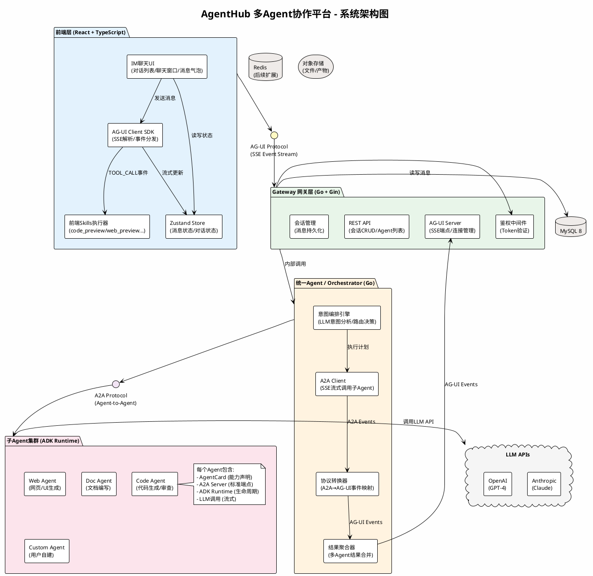
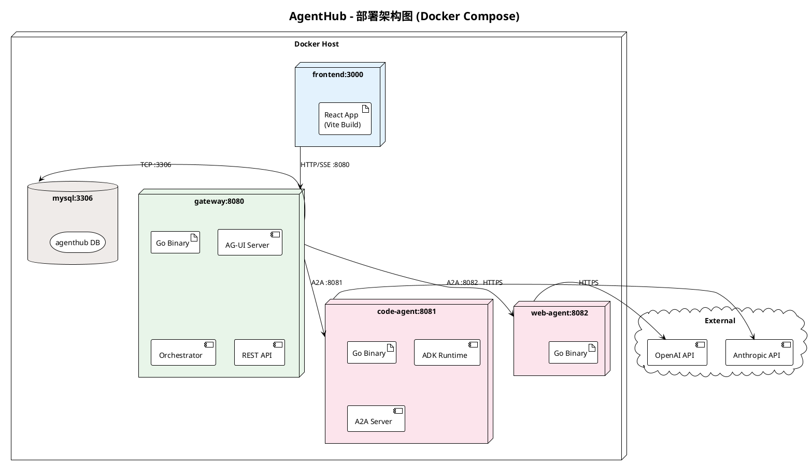
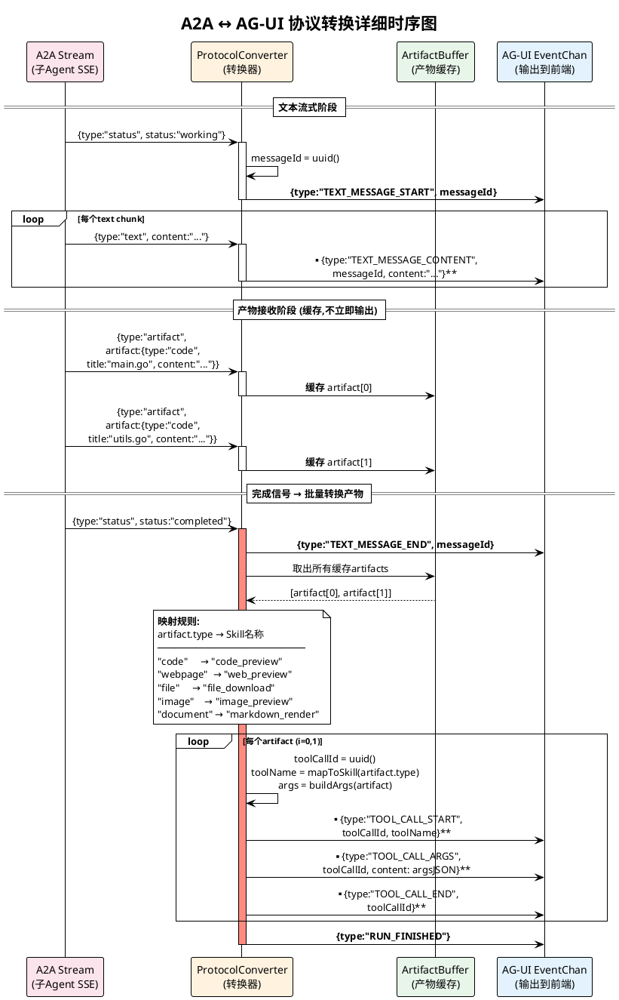
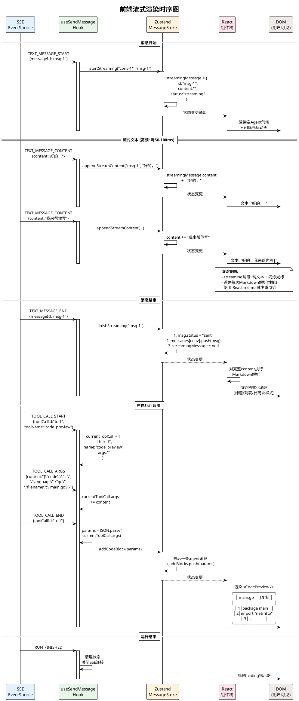
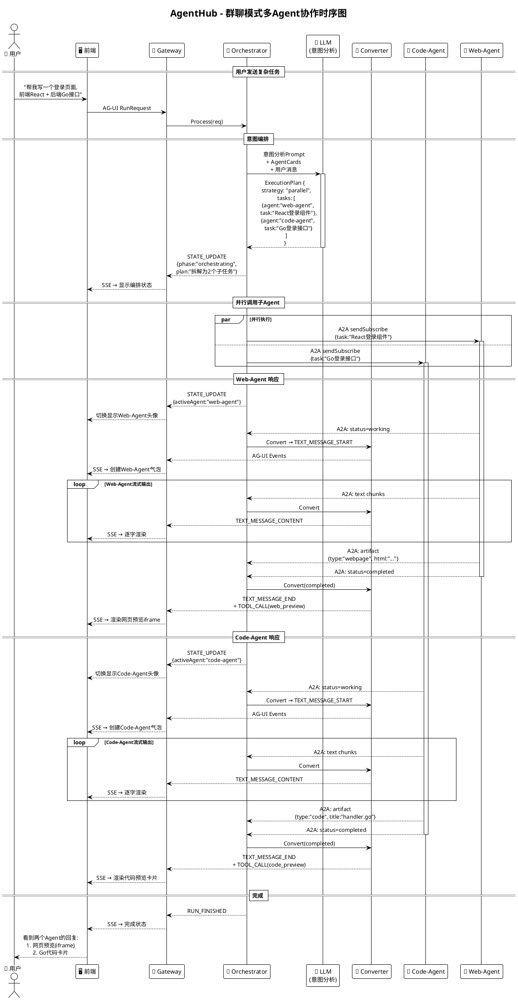
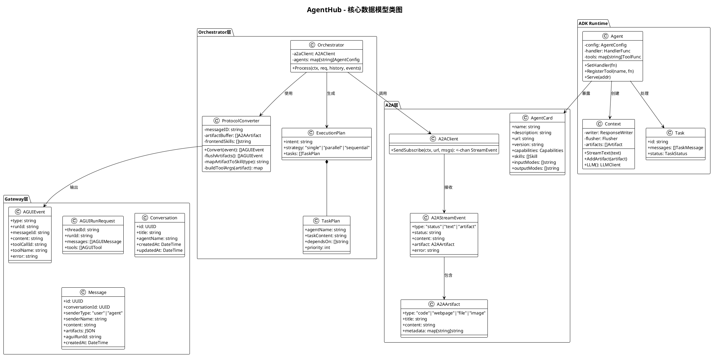
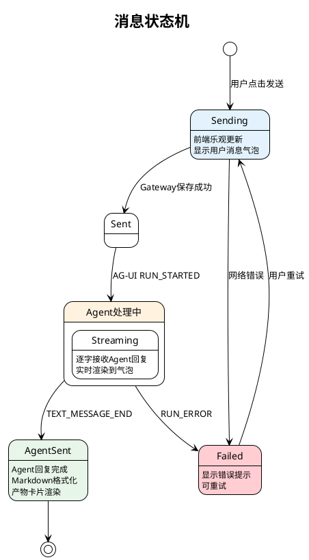
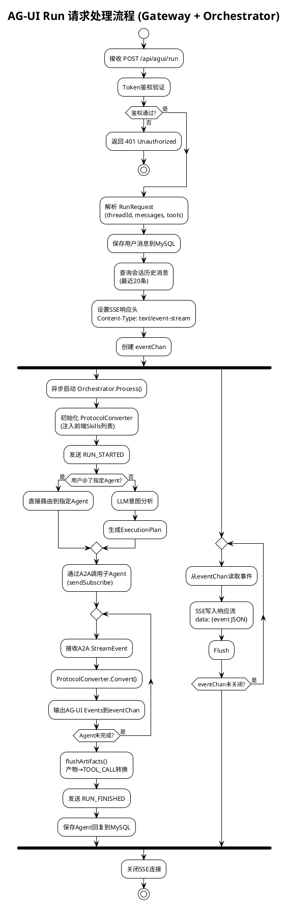

# AgentHub 系统 UML 图
## 使用说明：
安装PlantUML插件，
在 VS Code 的 settings.json 中添加：
```
{
  "plantuml.server": "https://www.plantuml.com/plantuml",
  "plantuml.render": "PlantUMLServer"
} 
```
操作步骤：
ctrl + Shift + P → 输入 Preferences: Open User Settings (JSON)


## 一、系统架构图（组件图）



## 二、系统分层架构图（部署视图）



## 三、核心时序图 - 单聊完整流程

```plantuml
@startuml AgentHub_Sequence_SingleChat
!theme plain
skinparam sequenceMessageAlign center
skinparam maxMessageSize 200

title AgentHub - 单聊模式完整时序图

actor User as "👤 用户"
participant React as "🖥️ React前端"
participant AGUIClient as "AG-UI Client\n(SSE解析)"
participant Gateway as "🚪 Gateway\n(Go/Gin)"
participant DB as "🗄️ MySQL"
participant Orchestrator as "🧠 Orchestrator"
participant Converter as "🔄 Protocol\nConverter"
participant A2AClient as "📡 A2A Client"
participant CodeAgent as "🔧 Code-Agent\n(ADK Runtime)"
participant LLM as "🤖 Anthropic\nAPI"

== 阶段1: 用户发送消息 ==

User -> React : 输入消息 + 点击发送
activate React
React -> React : 乐观更新UI\n(显示用户消息气泡)
React -> AGUIClient : 构建 RunRequest\n{threadId, runId, messages,\ntools:[code_preview]}
activate AGUIClient

== 阶段2: AG-UI请求到达Gateway ==

AGUIClient -> Gateway : **POST /api/agui/run**\nContent-Type: application/json
activate Gateway

Gateway -> Gateway : Token鉴权验证
Gateway -> DB : INSERT INTO messages\n(保存用户消息)
activate DB
DB --> Gateway : OK
Gateway -> DB : SELECT messages\nWHERE conversation_id=?\n(获取历史上下文)
DB --> Gateway : 历史消息列表
deactivate DB

== 阶段3: 建立SSE + 启动编排 ==

Gateway -> Gateway : 设置响应头:\nContent-Type: text/event-stream\nCache-Control: no-cache
Gateway -> Orchestrator : **异步启动** Process(\nctx, req, history, eventChan)
activate Orchestrator

== 阶段4: 编排决策 + A2A调用 ==

Orchestrator -> Orchestrator : 路由决策:\n直接选择 req.AgentName
Orchestrator -> Converter : 初始化(frontendSkills)
activate Converter

Orchestrator --> Gateway : eventChan ← RUN_STARTED
Gateway --> AGUIClient : **SSE:** {type:"RUN_STARTED"}
AGUIClient --> React : onEvent(RUN_STARTED)
React --> User : 显示Agent头像\n+ "正在思考..."

Orchestrator -> A2AClient : SendSubscribe(agentURL, messages)
activate A2AClient
A2AClient -> CodeAgent : **POST /a2a/tasks/sendSubscribe**\n{id:"task-1", messages:[...]}
activate CodeAgent

== 阶段5: Code-Agent处理 ==

CodeAgent -> CodeAgent : 加载SystemPrompt\n构建LLM消息列表
CodeAgent -> LLM : **POST /v1/messages**\nstream=true
activate LLM

CodeAgent --> A2AClient : A2A SSE:\n{type:"status", status:"working"}
A2AClient --> Orchestrator : StreamEvent(status:working)
Orchestrator -> Converter : Convert(status:working)
Converter --> Orchestrator : [TEXT_MESSAGE_START{msgId}]
Orchestrator --> Gateway : eventChan ← TEXT_MESSAGE_START
Gateway --> AGUIClient : **SSE:** {type:"TEXT_MESSAGE_START",\nmessageId:"msg-1"}
AGUIClient --> React : store.startStreaming()
React --> User : 创建空的Agent消息气泡\n+ 闪烁光标

== 阶段6: 流式文本传输 (核心循环) ==

loop 每个LLM token chunk (约50-100ms/次)
    LLM --> CodeAgent : SSE: content_block_delta\n{text:"package main..."}
    CodeAgent --> A2AClient : A2A SSE:\n{type:"text", content:"package main..."}
    A2AClient --> Orchestrator : StreamEvent(text)
    Orchestrator -> Converter : Convert(text)
    Converter --> Orchestrator : [TEXT_MESSAGE_CONTENT{content}]
    Orchestrator --> Gateway : eventChan ← TEXT_MESSAGE_CONTENT
    Gateway --> AGUIClient : **SSE:** {type:"TEXT_MESSAGE_CONTENT",\ncontent:"package main..."}
    AGUIClient --> React : store.appendStreamContent()
    React --> User : 气泡追加文字\n(逐字出现效果)
end

deactivate LLM

== 阶段7: 产物生成 ==

CodeAgent -> CodeAgent : parseCodeBlocks(fullResponse)\n检测到 ```go 代码块
CodeAgent -> CodeAgent : 生成Artifact:\n{type:"code", title:"main.go",\ncontent:"...", metadata:{language:"go"}}

CodeAgent --> A2AClient : A2A SSE:\n{type:"artifact", artifact:{...}}
A2AClient --> Orchestrator : StreamEvent(artifact)
Orchestrator -> Converter : Convert(artifact)
Converter -> Converter : **缓存Artifact**\n(不立即输出,等completed)

CodeAgent --> A2AClient : A2A SSE:\n{type:"status", status:"completed"}
deactivate CodeAgent
A2AClient --> Orchestrator : StreamEvent(status:completed)
deactivate A2AClient

== 阶段8: 协议转换 - Artifact→Skill ==

Orchestrator -> Converter : Convert(status:completed)
activate Converter #FF8A80

Converter --> Orchestrator : [TEXT_MESSAGE_END]
Orchestrator --> Gateway : eventChan ← TEXT_MESSAGE_END
Gateway --> AGUIClient : **SSE:** TEXT_MESSAGE_END
AGUIClient --> React : store.finishStreaming()
React --> User : 消息完成,\n移除闪烁光标

note over Converter
  **Artifact → TOOL_CALL 转换逻辑:**
  1. artifact.type == "code"
  2. 映射: "code" → "code_preview"
  3. 检查前端是否注册了该Skill ✓
  4. 构建args: {code, language, filename}
  5. 生成 TOOL_CALL 三事件序列
end note

Converter --> Orchestrator : [TOOL_CALL_START\n{toolName:"code_preview"}]
Orchestrator --> Gateway : eventChan ← TOOL_CALL_START
Gateway --> AGUIClient : **SSE:** {type:"TOOL_CALL_START",\ntoolCallId:"tc-1",\ntoolName:"code_preview"}

Converter --> Orchestrator : [TOOL_CALL_ARGS\n{content:"{code,lang,file}"}]
Orchestrator --> Gateway : eventChan ← TOOL_CALL_ARGS
Gateway --> AGUIClient : **SSE:** {type:"TOOL_CALL_ARGS",\ncontent:"{...}"}

Converter --> Orchestrator : [TOOL_CALL_END]
Orchestrator --> Gateway : eventChan ← TOOL_CALL_END
Gateway --> AGUIClient : **SSE:** TOOL_CALL_END

deactivate Converter

== 阶段9: 前端执行Skill + 完成 ==

AGUIClient --> React : 收集完整ToolCall\n解析args JSON
React -> React : 执行 code_preview Skill:\n渲染 <CodePreview\n  code="..." language="go"\n  filename="main.go" />
React --> User : 看到代码预览卡片\n(语法高亮+行号+复制按钮)

Orchestrator --> Gateway : eventChan ← RUN_FINISHED
deactivate Orchestrator
Gateway --> AGUIClient : **SSE:** {type:"RUN_FINISHED"}
AGUIClient --> React : 关闭SSE连接
deactivate AGUIClient
React --> User : 隐藏loading,\n显示完成状态
deactivate React

Gateway -> DB : INSERT INTO messages\n(保存Agent回复+artifacts)
deactivate Gateway

@enduml
```



## 四、协议转换时序图



## 五、前端流式渲染时序图



## 六、群聊多Agent协作时序图



## 七、类图 - 核心数据模型



## 八、状态图 - 消息生命周期



## 九、活动图 - AG-UI Run 处理流程


