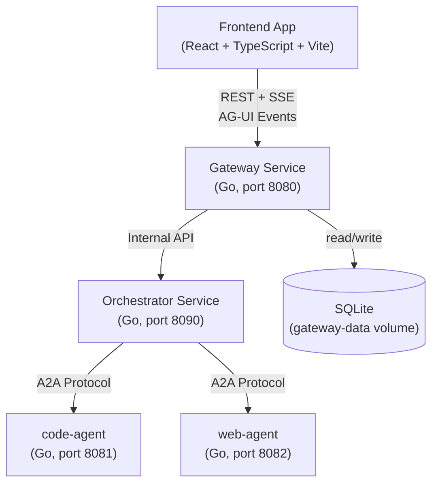
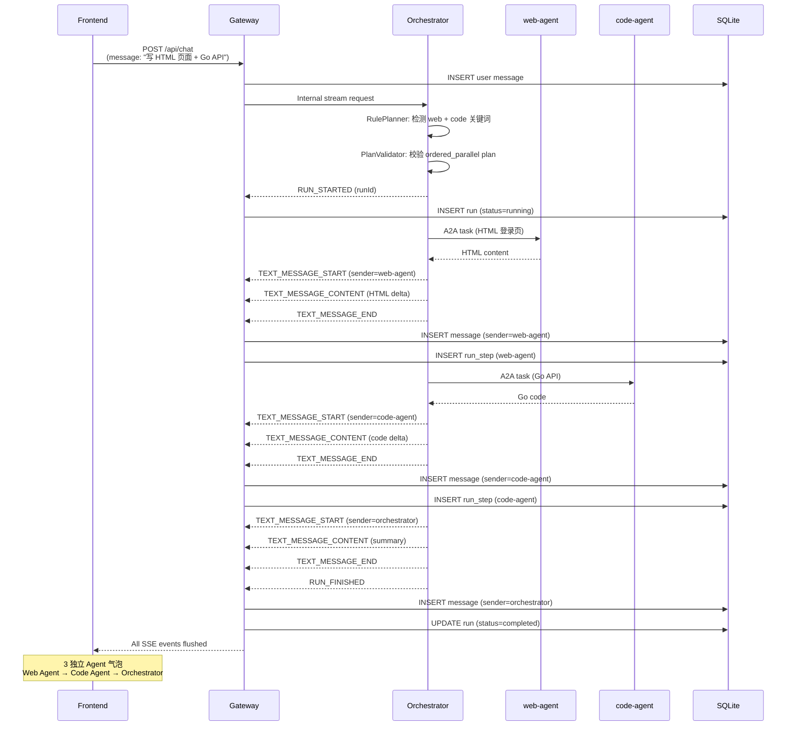

# AgentHub v1.0 最终架构说明

## 1. 项目定位

AgentHub 是一个基于 IM 聊天交互范式的多 Agent 协作平台。用户通过自然语言对话与不同的 AI Agent 交互，系统自动理解用户意图、生成执行计划、选择并调度 Agent，最终聚合结果并以结构化流式事件（SSE）返回前端。

v1.0 定位：**产品化平台基础**——完整的五服务独立进程架构，支持多 Agent 有序并行编排、结构化持久化、错误脱敏和确定性的 CI 验收。

## 2. v1.0 架构总览

### Mermaid 架构图



### Mermaid 时序图：Mixed Ordered Parallel



## 3. 服务职责

### 3.1 Gateway Service

- 对外 REST API（`/api/chat`, `/api/conversations`, `/api/agents`, `/health`）
- 对外 SSE stream（AG-UI 事件格式）
- 用户鉴权（Bearer Token）与 CORS
- 调用 Orchestrator 内部 API，**不直接调用 Agent**
- AG-UI 事件翻译（Orchestrator 内部事件 → 前端可消费事件）
- SQLite 持久化（Run/RunStep/Message 实时写入）
- 消息 replay（页面刷新恢复，保持 Multi-Agent 分离）
- 错误脱敏（TextStreamFilter 过滤敏感信息）

### 3.2 Orchestrator Service

- **RulePlanner**：基于关键词的确定性计划生成（不依赖真实 LLM）
- **PlanValidator**：计划合法性校验（Agent 存在性、能力匹配、taskId 唯一性）
- **SingleExecutor**：单 Agent 串行执行
- **OrderedParallelExecutor**：多 Agent 有序并行执行
- **A2A Dispatcher**：通过 A2A 协议调用 Child Agent
- **Agent Registry**：Agent 能力注册与 Health Check 过滤
- **Summary Aggregation**：多 Agent 结果聚合为 summary 消息
- **Fallback**：Agent 不健康时尝试替代 Agent

### 3.3 RulePlanner / PlanValidator

- RulePlanner 基于关键词规则生成 `OrchestrationPlan`（含 taskId、capabilityId、executionMode）
- 不依赖外部 LLM API，100% 确定性
- PlanValidator 校验：Agent 存在性、能力匹配、taskId 不重复、executionMode 合法
- 校验通过后进入 Executor 执行

### 3.4 code-agent / web-agent

- 已服务化，v0.1 deterministic mock 响应
- 实现 `/health` endpoint + A2A Server + AgentCard
- 符合 A2A 协议契约
- Dockerfile 已就绪
- 不调用真实 LLM

### 3.5 Frontend

- React + TypeScript + Vite + Tailwind CSS
- IM 聊天 UI（对话列表 + 消息区）
- AG-UI SSE 消费（每个 messageId 独立气泡，不合并）
- senderName / senderDisplayName 展示
- code preview + web preview 渲染
- Page refresh 消息恢复（replay）
- Error 安全展示（脱敏）

### 3.6 AG-UI / SSE Event 交互

- 所有 Chat 响应通过 SSE 流式返回
- 事件类型：`RUN_STARTED`、`TEXT_MESSAGE_START`、`TEXT_MESSAGE_CONTENT`、`TEXT_MESSAGE_END`、`RUN_FINISHED`、`RUN_ERROR`
- 每条消息通过 `sender.type` 和 `sender.name` 标识 Agent 归属
- 不同 `messageId` 对应不同 Agent 消息，前端根据 messageId 分离气泡

### 3.7 SQLite Persistence

- 6 表 + 12 索引：conversations、conversation_participants、runs、run_steps、messages、artifacts
- PersistentWriter：SSE event → SQLite 实时写入（delta 缓存，END 时落盘）
- Replay：`GET /api/conversations/{id}/messages` 从 SQLite 读取，返回独立 Agent 消息
- 环境变量切换 `memory` / `sqlite` 模式
- 默认 compose 使用 `sqlite` 模式 + named volume 持久化
- Migration runner：idempotent，embed.FS 驱动

### 3.8 Conversation / Run / RunStep / Message / Artifact 数据模型

```
Conversation (id, title, status, created_at, updated_at)
  ↓ 1:N
Run (id, conversation_id, status, planning_mode, started_at, finished_at, error_code)
  ↓ 1:N
RunStep (id, run_id, task_id, step_index, agent_name, capability_id, status, error_code)
  ↓ 1:N
Message (id, conversation_id, run_id, step_id, message_id, role, sender_type, sender_name, agent_name, content, status, error_code)
  ↓ 1:N
Artifact (id, conversation_id, run_id, step_id, message_id, artifact_type, title, mime_type, content_ref, status)
```

### 3.9 docker-compose.new-arch.yml

- 五服务独立进程拓扑：frontend-new → gateway-new → orchestrator-new → code-agent-new / web-agent-new
- Gateway 不持有 Agent URL（CI 断言验证）
- SQLite named volume `gateway-data` 挂载到 `/data`
- 所有服务有 healthcheck
- 不依赖真实 LLM key

### 3.10 Legacy 边界

- `server/`：MVP v0.1 旧 Gateway（含内嵌 Orchestrator），**不再扩展**
- `agents/`：旧 Agent 能力池与未来服务化候选池，**不参与 v1.0 runtime**
- `docker-compose.yml`：Legacy compose（单 Agent + MySQL + 真实 LLM），**不扩展**
- 新功能进入 `services/gateway`、`services/orchestrator`、`services/agents/*`
- 详细边界定义见 `docs/refactor/legacy-boundary.md`

---

- Created: 2026-06-05
- Step: AgentHub v1.0 Step 5 — Final Architecture Overview
